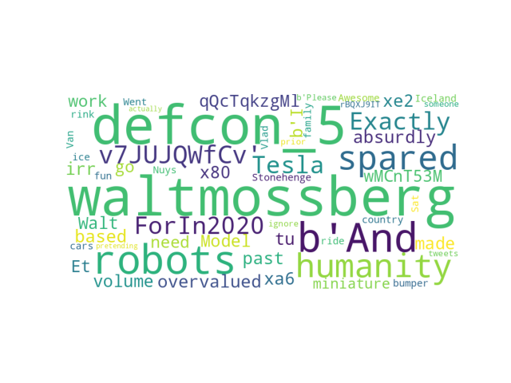

# twitter_exercise
exercise 02 of certik technical assesment. Elon Musk Twitter Sentiment Analysis.

This program takes input of a csv file of elon musks tweets. 

Output is some png's analyzing Elon Musks tweets...

##Architecture
I used scrapy for retrieving data. Matplotlib, wordcloud, nltk and pandas for data analysis. 

